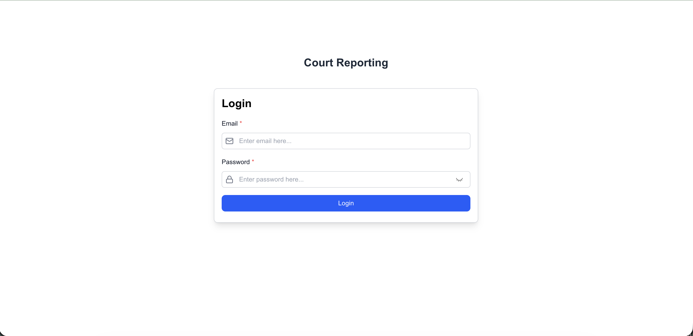
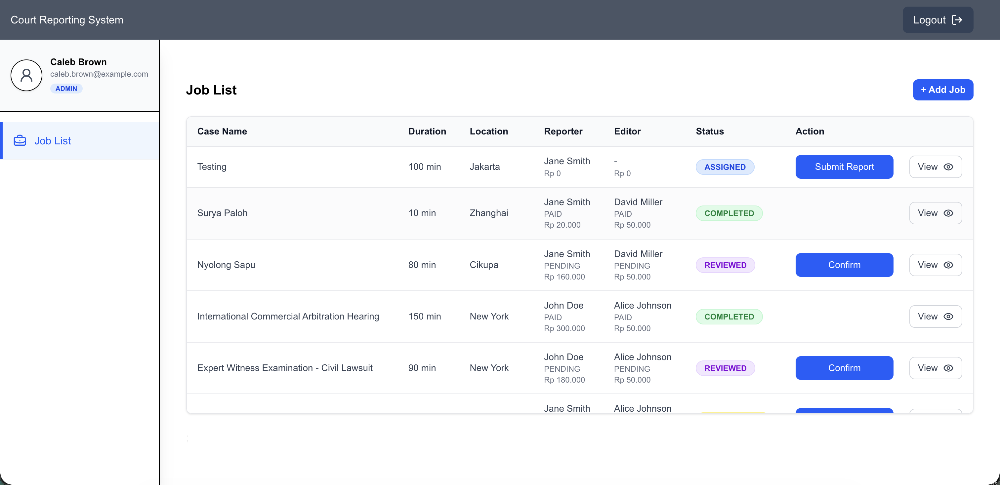

# Court Reporting Manager

An integrated Court Reporting management system designed to efficiently handle transcription workflows, reviews, and automated payout calculations for Reporters and Editors.

**Live Demo:** [https://court-reporting-phi.vercel.app/](https://court-reporting-phi.vercel.app/)




## 🚀 Key Features

- **Job Management:** Track job statuses from _pending_, _transcribed_, and _reviewed_, through to _completed_.
- **Transcription System:** Supports audio file uploads with AI integration for automated transcription results.
- **Automated Payouts:** Intelligent calculation of earnings for Reporters and Editors based on duration and role.
- **Role-Based Dashboard:** Secure access control for Admins, Editors, and Reporters to streamline the workflow.

## 🛠️ Tech Stack

- **Framework:** [Next.js 16](https://nextjs.org/) (App Router)
- **Language:** TypeScript
- **Styling:** [Tailwind CSS](https://tailwindcss.com/)
- **State Management/Data Fetching:** [TanStack React Query](https://tanstack.com/query/latest)
- **Forms:** [React Hook Form](https://react-hook-form.com/)
- **Icons:** [Lucide React](https://lucide.dev/)

## 📋 Installation Guide

### 1. Clone Repository

```bash
git clone https://github.com/marcel-maruli/court-reporting.git
cd court-reporting
```

### 2. Dependencies Installation

```bash
npm install
```

### 3. .env Configuration

```bash
NEXT_PUBLIC_API_URL=[https://api-court-reporting-manager-esfx.vercel.app/](https://api-court-reporting-manager-esfx.vercel.app/)
```

### 4. Running Application

```bash
npm run dev
```

### 5. Login with these

| Nama         | Email                    | Role     | Password |
| ------------ | ------------------------ | -------- | -------- |
| Caleb Brown  | caleb.brown@example.com  | Admin    | 12345    |
| David Miller | david.miller@example.com | Editor   | 12345    |
| Jane Smith   | jane.smith@example.com   | Reporter | 12345    |

### 6. Project Structure

- /src/components: Reusable UI components (Modals, Buttons, etc.).
- /src/libs: API connection logic and React Query hooks.
- /src/utils: Utility functions such as Toast notifications and other helpers.
